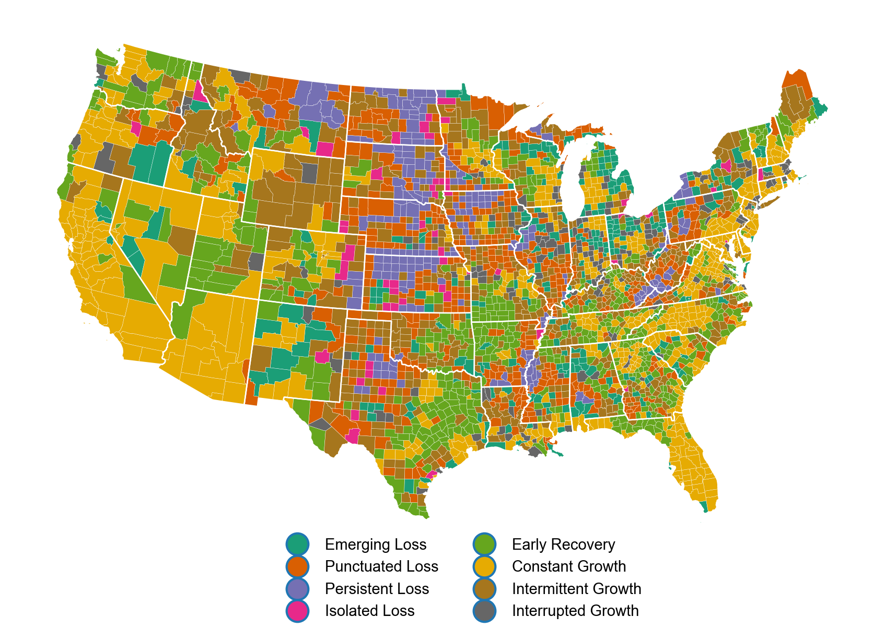

# County Typology Paper Data Project

The objective of this project is to create a county-level typology of U.S. counties based on historical population change. 

# Workflow

## Data preparation

I read all data into a SQLite/Spatialite database using the Python scripts located in scripts/create_database. [Spatialite](http://www.gaia-gis.it/gaia-sins/) is a spatial extension of [SQLite](https://sqlite.org/index.html), an open-source, file-based relational database. The Python standard library comes includes the `sqlite3` module providing an API for querying SQlite databases. Spatialite is to SQLite what PostGIS is to Postgres. The non-standard Python module `pysqlite2` is needed to apply spatial queries.

__NOTE:__ `init_db.sh` is the **first** script that needs to be run to rebuild the research database from scratch. This script will overwrite/create a new Spatialite database and populate it with shapefiles for states and counties. This file reads multiple distinct versions of US counties, including versions with and without clean coastlines. These are important to distinguish for correctly identifying neighboring contiguous counties.

The other file in the `scripts/create_database` reads historical county population data into the database.

## Typology

The typology workflow consists of the following stages:

* Classify counties into one of four categories for each decadal period based on whether they individually lost or gained population and whether their contiguous neighbors lost or gained population, using a population-weighted average of each neighboring counties population change. See `code_county_decades_for_traminer.py`.
* Counties that lost population and whose neighbors lost population (on average) are coded 'A', those that lost pop. and whose neighbors grew are coded 'B', those that grew and whose neighbors lost are 'C', and those who grew and whose neighbors grew are 'D'.

```python
df.loc[ (df['ppctchg'] < 0) & (df['nbr_avg_ppctchg'] < 0), 'category'] = 'A'
df.loc[ (df['ppctchg'] < 0) & (df['nbr_avg_ppctchg'] >= 0), 'category'] = 'B'
df.loc[ (df['ppctchg'] >= 0) & (df['nbr_avg_ppctchg'] < 0), 'category'] = 'C'
df.loc[ (df['ppctchg'] >= 0) & (df['nbr_avg_ppctchg'] >= 0), 'category'] = 'D'
```   

* Each county then has a sequence of each of these four states for each decade from 1950-1960 to 2000-2010. I then created a typology of sequences using the `TraMineR` package in R. This is the same package used by Elizabeth Delmelle for the paper, "Mapping the DNA of Urban Neighborhoods." __NOTE: I created separate typologies for counties that lost population and those that gained population 2000-2010. This necessarily privileges the most recent period in grouping counties__. 
* To cluster states using the `TraMineR` package we must first create a state sequence object from the input data using `seqdef`
* We then need to create a substitution matrix and assign insert/deletion costs. These are the costs we wish to impose for changing a state in a given sequence in order to render that sequence identical to another. For this we use `seqcost`.
* We next calculate the distances between sequences using the substitution matrix and insert/del costs using `seqdist`. __NOTE: The parameters supplied in this argument matter the most for the resulting typology__. We selected the `OMspell` method, which creates a distance matrix based on an optimal matching (OM) algorithm based on spells (consecutive states) rather than individual states, given that this better reflects our intuition for how one would compare any two sequences in a manual process. We also set `tpow` to 1.5 (default is 1.0). This is the exponential weight of the spell length applied in calculating distances between sequences. We also set the `expcost`, the cost of spell length transformation, to 1.0 (default is 0.5). These two settings privilege the length of spells in the distance calculations, consistent with our interest in sorting places based on the persistence of growth/loss. 
* Using this distance matrix we then apply hierarchical clustering using Ward's method to cluster the sequences.
* We decided to retain four clusters of loss and four clusters of growth.
* After completing the clustering, I added the results to the SQLite database using `typology_to_db.py`
* To visualize the results, I mapped them using `maps/trajectory_map_combined.py`

